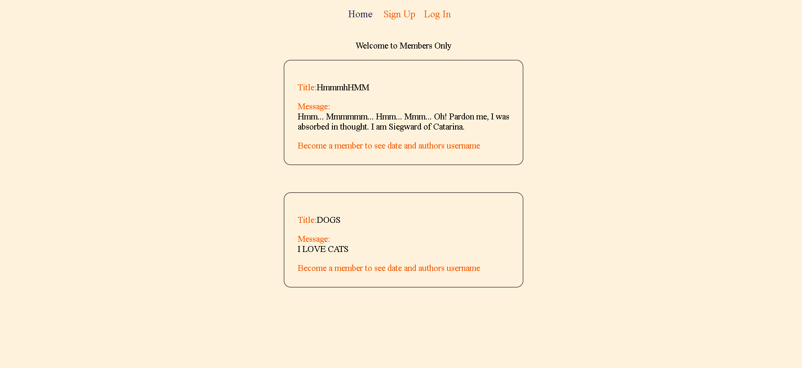

# Members Only

This project is the part of [nodejs](https://members-only-production-de29.up.railway.app/home) course on the odin projects full stack javascript cirriculum.


## Screenshot



  
## Demo


🔑 Member Code : `odinisbest`

👉 See it live [here](https://members-only-production-de29.up.railway.app/home)

  
## Features

- `Public messages:` Users can create and read public messages.
- `User authentication:` PassportJS is used for user authentication.
- `User authorization:` Admin, member, and non-member but registered user roles are - - available for user authorization and permissions management.
- `Password security:` Passwords are secured using bcryptjs.
- `Membership management:` Users can gain membership by entering a secret code.
- `What is the membership for?:` Only members can see the author and timestamp of the messages
- `Schema validation:` Mongoose is used for schema validation to ensure data consistency and accuracy.

  
## Run project locally

Clone the project

```bash
  git clone https://github.com/mustafa-mun/members-only.git
```

Go to the project directory

```bash
  cd members-only
```

Install the required packages

```bash
  npm install
```

Start the server

```bash
  npm  start
```

  
